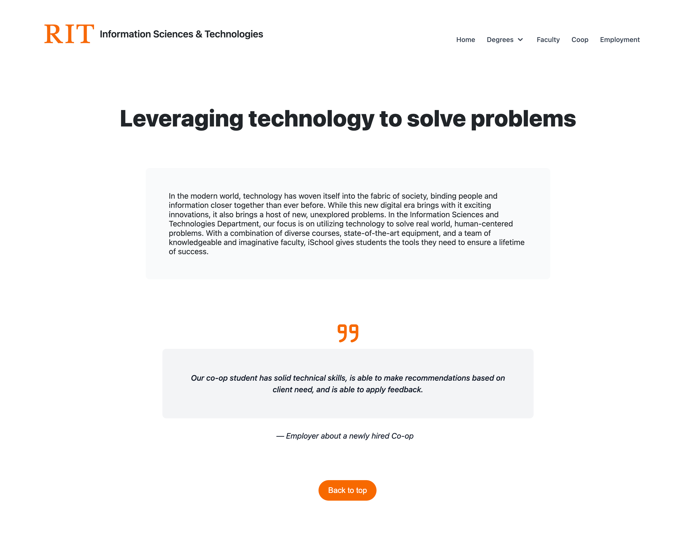
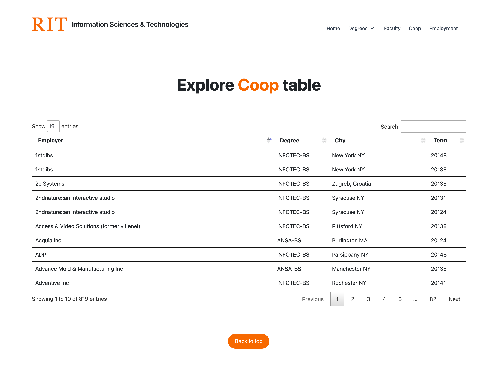
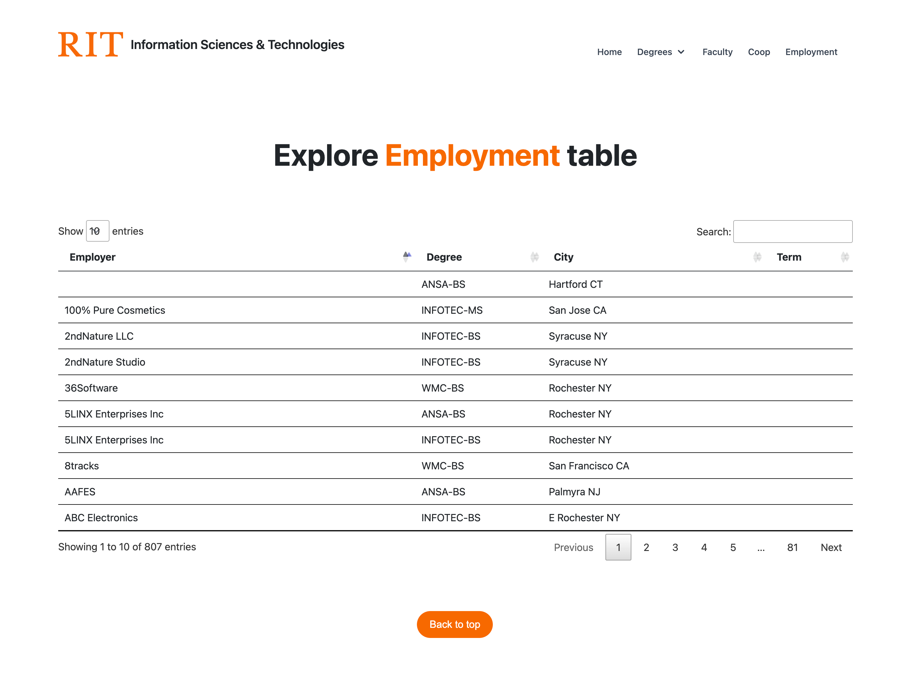

<!-- RIT IST -->
 

 
 

<!-- ABOUT -->
## About

RIT IST (Information Sciences & Technology) is web redesign for the IST department within the B. Thomas Golisano College of Computing and Information Sciences. The IST department offers undergraduate, graduate and minor degree programs that focus on the intersection of technology, business, and communication. The department aims to equip students with the necessary skills and knowledge to design, develop, and manage technology-based solutions for real-world problems.
 
 
The content provided within the web redesign is created using the MVC architecture and dynamically generated using C# and ASP.NET, with the data being requested and retrieved using an API in JSON format.
 

<!-- API -->
## API

`http://www.ist.rit.edu/api/`

API endpoints:

`http://www.ist.rit.edu/api/about/`

`http://www.ist.rit.edu/api/degrees/undergraduate`

`http://www.ist.rit.edu/api/degrees/graduate`

`http://www.ist.rit.edu/api/minors`

`http://www.ist.rit.edu/api/employment/coopTable`

`http://www.ist.rit.edu/api/employment/employmentTable`

<!-- TECHNOLOGY -->
## Technology

* [![csharp][csharp]][csharp-url]
* [![net][net]][net-url]

<!-- GALLERY -->
## Gallery

    

    

 

<!-- CONTACT -->
## Contact

[![linkedin][linkedin]][linkedin-url]
[![email][email]][email-url]

<!-- MARKDOWN LINKS & IMAGES -->
<!-- https://www.markdownguide.org/basic-syntax/#reference-style-links -->
[linkedin]: https://img.shields.io/badge/-LinkedIn-black.svg?style=for-the-badge&logo=linkedin&colorB=555
[linkedin-url]: https://www.linkedin.com/in/jurajstefanic/
[email]: https://img.shields.io/badge/email-555?style=for-the-badge&logo=gmail&logoColor=white
[email-url]: mailto:jurajstefanic@outlook.com
[csharp]: https://img.shields.io/badge/c%23-239120?style=for-the-badge&logo=c-sharp&logoColor=white
[csharp-url]: https://learn.microsoft.com/en-us/dotnet/csharp/
[net]: https://img.shields.io/badge/asp.net-512BD4?style=for-the-badge&logo=.net&logoColor=white
[net-url]: https://dotnet.microsoft.com/en-us/
